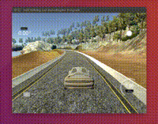
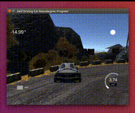

# **Behavioral Cloning** 

---

**Behavrioal Cloning Project**

The goals / steps of this project are the following:
* Use the simulator to collect data of good driving behavior
* Build, a convolution neural network in Keras that predicts steering angles from images
* Train and validate the model with a training and validation set
* Test that the model successfully drives around track one without leaving the road
* Summarize the results with a written report


**Image References**

[Visualing the 3 camera views](./visualising_camera_views_incl_code.png)

[Telemetry statistics](./telemetry_statistics.png)

[Steering angles histogram](./steering_angles_histogram_incl_code.png)

[Layer 1 spatial reduction calcs](./spatial_reduction_calcs.png)

[Model](./model.png)
 
[Toolset](./tools.png)

[Cropped images example](./cropped_images_example.png)

[Randomly shadowed images example](./randomly_shadowed_images_example.png)

[Original image example](./original_image.png)

[Original image shadowed and mirrored example](./original_image_shadowed_and_mirrored.png)

[Training track 1 GIF](./track_1_lap_1_success.gif)

[Training track 1 success complete video](https://www.youtube.com/watch?v=bmZ-OaNCpcw)

[Test track 2 failure](./track_2_failure.png)

[Test track 2 GIF - Failure](./track_2_fail_ubuntu_desktop_in_background.gif)

[Test track 2 success](./track_2_completed.png)

[Test track 2 success complete video](https://www.youtube.com/watch?v=2eJhYIdonVo)

## Rubric Points
### Here I will consider the [rubric points](https://review.udacity.com/#!/rubrics/432/view) individually and describe how I addressed each point in my implementation.  

---

### Files Submitted & Code Quality

#### 1. Submission includes all required files and can be used to run the simulator in autonomous mode

My project includes the following files:
1. model.py containing the script to create and train the model
1. drive.py for driving the car in autonomous mode
1. model.h5 containing a trained convolution neural network 
1. writeup_report.md summarizing the results

#### 2. Submssion includes functional code
Using the Udacity provided simulator and my drive.py file, the car can be driven autonomously around the track 
by executing 
```sh
python drive.py model.h5
```

#### 3. Submssion code is usable and readable

The model.py file contains the code for training and saving the convolution neural network. The file shows 
the pipeline I used for training and validating the model, and it contains comments to explain how the code works.
```python
if __name__ == '__main__':
    # Edit the class CONSTANTS at the top of this file for your own environment.

    # Even out angle telemetry distribution.
    Preprocess.truncate_highly_logged_angles()

    # Generate more simulated telemetry angle data.
    Preprocess.create_left_right_steering_angles()

    # Separate datasets, ready for model training / validation.
    Preprocess.split_out_training_and_validation_datasets()

    # Build model and display layers
    model = Preprocess.build_nvidia_model(dropout=DROPOUT)
    print(model.summary())

    plot(model, to_file='model.png', show_shapes=True)

    # Save checkpoint to enable EarlyStopping
    checkpoint = ModelCheckpoint("checkpoints/model-{val_loss:.4f}.h5",
                                 monitor='val_loss', verbose=1,
                                 save_weights_only=True, save_best_only=True)

    # Save logs for TensorBoard network investigations
    tensorboard = TensorBoard(log_dir='./logs', histogram_freq=0, write_graph=True, write_images=False)

    # Model training / validation can overshoot minimum, so stop training when this occurs.
    earlystopping = EarlyStopping(monitor='val_loss', min_delta=0, patience=5, verbose=1, mode='auto')

    # Train model in batches, 1 image at a time.
    model.fit_generator(Preprocess.training_data_generator(PATH, BATCH_SIZE),
                        samples_per_epoch=BATCH_SIZE * int(num_train_images / BATCH_SIZE),
                        nb_epoch=EPOCHS, callbacks=[earlystopping, checkpoint],
                        validation_data=Preprocess.validation_data_generator(VAL_PATH, BATCH_SIZE),
                        nb_val_samples=num_test_images)

    # save weights and model
    model.save_weights('model_weights.h5')
    with open('model.json', 'w') as modelfile:
        modelfile.write(model.to_json())

    # Fri, 10/Feb/2017 new project submission requirement : combine weights (.h5) + model (.json) into model.h5.
    model.save('model.h5')

```

### Preprocess Architecture and Training Strategy

#### 1. An appropriate model architecture has been employed

My model consists of a convolution neural network based on nvidia end-to-end model with 5x5 filter sizes and 
depths between 32 and 128 (model.py lines 246 - 305) 

The model includes PReLU layers to introduce nonlinearity for the activation (e.g. code line 269), and the data is normalized in the 
model using a Keras lambda layer (code line 264-5). 

####2. Attempts to reduce overfitting in the model

The model contains dropout layers in order to reduce overfitting (e.g. model.py lines 279). 

The model was trained and validated on different data sets to ensure that the model was not overfitting 
(code line 73-82). The model was tested by running it through the simulator on Track 1 each time I experimented 
with changing a single variable to ensre that the vehicle could stay on the track.
* 
* [Training track 1 GIF](./track_1_lap_1_success.gif)
* [Training track 1 success complete video](https://www.youtube.com/watch?v=bmZ-OaNCpcw)

####3. Preprocess parameter tuning
The model used an adam optimizer (nadam), so the learning rate was not tuned 
manually (model.py line 304).

####4. Appropriate training data

Training data was chosen to keep the vehicle driving on the road. I applied the 
[approach documented](https://chatbotslife.com/using-augmentation-to-mimic-human-driving-496b569760a9#.aws3sjkru) by a fellow 
student [Vivek Yadav](https://medium.com/@vivek.yadav) to generate random recovery 
and shadowed training images. 

For details about how I created the training data, see the next section. 

###Preprocess Architecture and Training Strategy
####1. Solution Design Approach

The overall strategy for deriving a model architecture was to start with a
proven model and then fine-tune the architecture and parameters until it 
could successfully drive the simulated car around Test track 2.

My first step was to use a convolution neural network model similar to the [Nvidia End To End Learning for Self-Driving Cars](http://images.nvidia.com/content/tegra/automotive/images/2016/solutions/pdf/end-to-end-dl-using-px.pdf) 
I thought this model might be appropriate because it focused on mapping raw pixels
from front-facing cameras directly to steering commands.

In order to gauge how well the model was working, I split my image and 
steering angle data into a training and validation set. 
I found that my first model had a low mean squared error on the training set 
but a high mean squared error on the validation set. 
This implied that the model was overfitting. 

To combat the overfitting, I modified the model so that a dropout regularisation
was applied after the final hidden layer and then after each fully connected
layer.

Then I cropped the images as per the Nvidia model (66x200x3), experimented with 
the model architecture by added a fourth fully connected layer 
(model.py lines 284 - 287), adjusting the spatial reduction (model.py lines 285, 294, 299), 
adjusting the dropout percentage (model.py line 20) and shifting the left / right 
images and corresponding driving angles (model.py line 69).

The above steps where done iteratively while running the simulator to see how well 
the car was driving around track one aka to establish cause and effect.

I also viewed track 2 performance to see if the model would generalise. The key issue was
the tight turn at the top of the mountain which is not present on track 1.
* 
* [Test track 2 GIF - Failure](./track_2_fail_ubuntu_desktop_in_background.gif)

I resisted the temptation of recording this section of track 2 and retraining the model as 
I wanted to experiment with the various parameters on the track 1 training dataset instead.

After much trial and error, it was truncating the number of examples to create a better shaped
distribution by applying fibonacci sequences (model.py lines 50, 53) that enabled successful 
generalisation to track 2.

At the end of the process, the vehicle is able to drive autonomously around track 1 and 
track 2 without leaving the road.
* 
* [Test track 2 success complete video](https://www.youtube.com/watch?v=2eJhYIdonVo)

####2. Final Preprocess Architecture

The final model architecture (model.py lines 18-24) consisted of a convolution neural network 
with the following layers and layer sizes ...

```text
____________________________________________________________________________________________________
Layer (type)                     Output Shape          Param #     Connected to                     
====================================================================================================
Normalization (Lambda)           (None, 66, 200, 3)    0           lambda_input_1[0][0]             
____________________________________________________________________________________________________
convolution2d_1 (Convolution2D)  (None, 31, 98, 32)    2432        Normalization[0][0]              
____________________________________________________________________________________________________
prelu_1 (PReLU)                  (None, 31, 98, 32)    97216       convolution2d_1[0][0]            
____________________________________________________________________________________________________
convolution2d_2 (Convolution2D)  (None, 14, 47, 64)    51264       prelu_1[0][0]                    
____________________________________________________________________________________________________
prelu_2 (PReLU)                  (None, 14, 47, 64)    42112       convolution2d_2[0][0]            
____________________________________________________________________________________________________
convolution2d_3 (Convolution2D)  (None, 5, 22, 128)    204928      prelu_2[0][0]                    
____________________________________________________________________________________________________
prelu_3 (PReLU)                  (None, 5, 22, 128)    14080       convolution2d_3[0][0]            
____________________________________________________________________________________________________
convolution2d_4 (Convolution2D)  (None, 3, 20, 128)    147584      prelu_3[0][0]                    
____________________________________________________________________________________________________
prelu_4 (PReLU)                  (None, 3, 20, 128)    7680        convolution2d_4[0][0]            
____________________________________________________________________________________________________
convolution2d_5 (Convolution2D)  (None, 1, 18, 128)    147584      prelu_4[0][0]                    
____________________________________________________________________________________________________
prelu_5 (PReLU)                  (None, 1, 18, 128)    2304        convolution2d_5[0][0]            
____________________________________________________________________________________________________
dropout_1 (Dropout)              (None, 1, 18, 128)    0           prelu_5[0][0]                    
____________________________________________________________________________________________________
flatten_1 (Flatten)              (None, 2304)          0           dropout_1[0][0]                  
____________________________________________________________________________________________________
dense_1 (Dense)                  (None, 256)           590080      flatten_1[0][0]                  
____________________________________________________________________________________________________
prelu_6 (PReLU)                  (None, 256)           256         dense_1[0][0]                    
____________________________________________________________________________________________________
dropout_2 (Dropout)              (None, 256)           0           prelu_6[0][0]                    
____________________________________________________________________________________________________
dense_2 (Dense)                  (None, 128)           32896       dropout_2[0][0]                  
____________________________________________________________________________________________________
prelu_7 (PReLU)                  (None, 128)           128         dense_2[0][0]                    
____________________________________________________________________________________________________
dropout_3 (Dropout)              (None, 128)           0           prelu_7[0][0]                    
____________________________________________________________________________________________________
dense_3 (Dense)                  (None, 64)            8256        dropout_3[0][0]                  
____________________________________________________________________________________________________
prelu_8 (PReLU)                  (None, 64)            64          dense_3[0][0]                    
____________________________________________________________________________________________________
dropout_4 (Dropout)              (None, 64)            0           prelu_8[0][0]                    
____________________________________________________________________________________________________
OutputAngle (Dense)              (None, 1)             65          dropout_4[0][0]                  
====================================================================================================
Total params: 1,348,929
Trainable params: 1,348,929
Non-trainable params: 0
____________________________________________________________________________________________________

```

Here is a visualization of the architecture ...


####3. Creation of the Training Set & Training Process

To capture 'good' driving behavior, I first tried to record two laps on track one using center lane driving.

At this point I made the decision to only use the Udacity provided dataset and concentrate 
all my efforts on preprocessing, model architecture and parameter fine-tuning (including adjusting the 
throttle)instead.

To augment the data, I : 
1. cropped the image so that mainly road and low horizon was capture
* 
2. randomly shadowed the image
* 
3. randomly mirrored the image and associated steering angle
*  original
*  shadowed and mirrored
